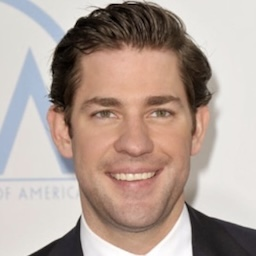
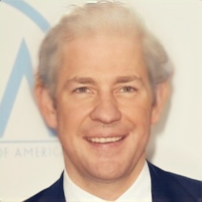
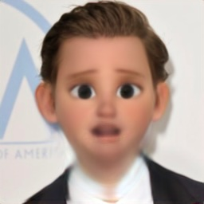
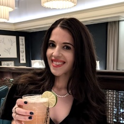
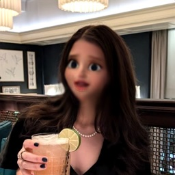
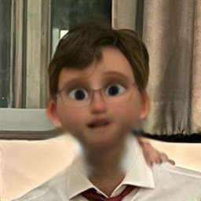
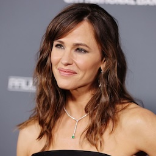
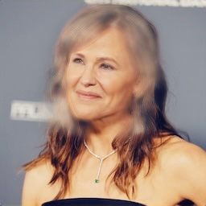
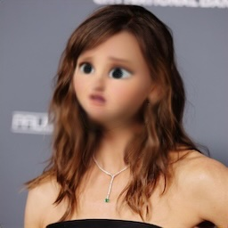
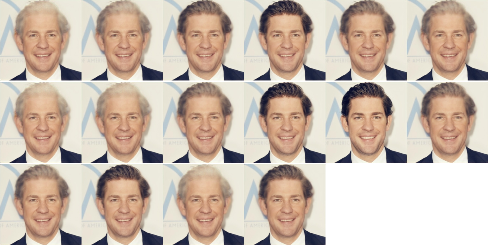

# FilterClone

I trained neural networks to apply intelligent "filters" to images. These neural networks are trained by cloning popular Snapchat lenses. Here are some examples:

| Input        | Aged Filter   | Cartoon Filter   |
|--------------|---------------|------------------|
|  |  |  |
|  |  |  |
|  |  |  |
|  |  |  |

# How it works

## Dataset

I created a dataset of around 100K input-output pairs, where the input is an image and the output is the result of applying a filter. For input images, I reused my [filtering code](https://github.com/unixpickle/laion-icons) for the LAION dataset to scrape images which were likely to contain human faces. To get output images, I reverse engineered pieces of Snapchat's Chrome extension to apply Snapchat lenses to the input images.

Annoyingly, I found that Snapchat lenses only "worked" for about ~25% of my input images. The rest of the time, the lens did something trivial like change the saturation of the whole image, or slightly blur the background based on some primitive foreground detector; it didn't change the person's face at all.

To mitigate this, I used a collection of scripts to hand label and filter out useless input-output pairs. These scripts are found in the [filter_dataset](filter_dataset) folder.

## Model architecture

Once I had a dataset, I trained convolutional UNet models on the input-output pairs. I opted to use a simple regression objective to train these models&mdash;for a given input, the model tries to predict the median of each output pixel independently. Note that this is different from something like a diffusion model, where we are actually _sampling from a distribution_ of possible outputs.

Regression can be problematic in the face of nondeterminism. For example, imagine that a lens randomly chooses to make your beard white or black. With a regression model, the best we can do is predict the _average_ color, i.e. gray. Also note that, even if the lens itself is deterministic, we might introduce nondeterminism when applying data augmentation, such as random crops, to the dataset.

To allow the model to be _slightly_ generative, and therefore deal with some nondeterminism, I introduced a single discrete latent code as an extra input to the model. Without going into the details too much, this makes our model a [VAE](https://en.wikipedia.org/wiki/Variational_autoencoder), allowing us to sample a handful of possible outputs for a given input. One single discrete latent code only gives us a _tiny_ amount of generative power, but it's still cool to see that we can really sample multiple possible outputs for one input:



# Pretrained models

Here are pre-trained models for some filters:

 * [Aged/old filter](https://data.aqnichol.com/FilterClone/old_model.plist)
 * [Cartoon filter](https://data.aqnichol.com/FilterClone/cartoon_model.plist)

# Applying filters

You can run a web UI to apply a filter like so:

```
$ swift run -c release FilterApply --model-path <my_model_file.plist>
```

By default, this will listen on `http://localhost:1235`.
